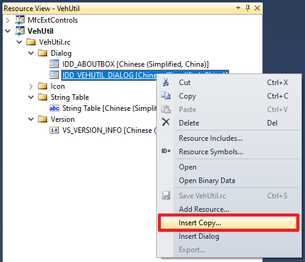
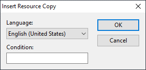
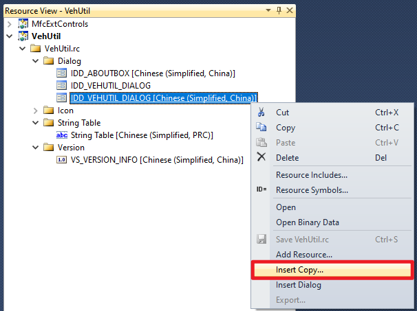
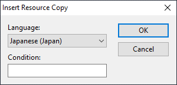
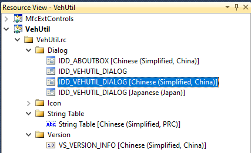
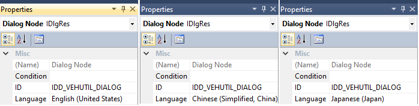

国际化：实现多国语言界面
=============================

《MFC程序国际化：实现多国语言界面》

.. toctree::
   :maxdepth: 5
   :numbered:

前言
------

写作目的
~~~~~~~~~~

本文旨在演示如何为 MFC 程序增加多国语言界面。某产品从国内使用转为外贸出口，为此产品开发的上位机软件采用的是简体中文界面，现在需要对上位机软件进行改造，增加英文等多国语言界面。
为了实现这一需求，本人编写了一个演示程序（见 :numref:`演示程序` :ref:`label-section-demoutil` ），通过为这个演示程序增加多国语言界面来探讨 MFC 程序的国际化技术。

.. _label-section-demoutil:

演示程序
~~~~~~~~~~

本文配套的演示程序采用递进的方式逐渐增加多国语言界面及相关功能。演示程序的各个版本如 :numref:`table_mfcmul_DemoUtilVersionsTable` 所示。通过下载链接可得到演示程序的源代码、VS2010工程文件和编译后的可执行程序。

.. list-table:: 演示程序的各个版本
   :name: table_mfcmul_DemoUtilVersionsTable
   :widths: 10 18 18
   :header-rows: 1
   :align: center

   * - 版本号
     - 下载链接
     - 说明
   * - 0.2.0.0
     - :download:`下载：Multilingual_v0.2.0.0.zip <./Resource/Demos/Multilingual_v0.2.0.0.zip>`
     - 初始版本
   * - 0.2.0.1
     - :download:`下载：Multilingual_v0.2.0.1.zip <./Resource/Demos/Multilingual_v0.2.0.1.zip>`
     - 小改动
   * - 0.2.0.2
     - :download:`下载：Multilingual_v0.2.0.2.zip <./Resource/Demos/Multilingual_v0.2.0.2.zip>`
     - 增加多国语言显示界面
   * - 0.2.0.3
     - :download:`下载：Multilingual_v0.2.0.3.zip <./Resource/Demos/Multilingual_v0.2.0.3.zip>`
     - 增加界面显示语言选择对话框

演示程序的初始版本仅包括一个中文界面，如 :numref:`fig_mfcmul_DisplayUI_InitVersion` 所示。

.. figure:: Resource/images/Snipaste_2026-09-09_14-06-41.png
    :name: fig_mfcmul_DisplayUI_InitVersion
    :align: center

    演示程序（初始版本）显示界面

为了方便公司同事，演示程序采用 Visual C++ 2010 (VC++ 10.0) 开发。项目的字符集设置为Unicode，以避免界面上的文字在非同族语言环境中被显示为乱码，这一点非常重要。

注：在创建演示程序的时候，在MFC应用程序向导中，将资源语言设置（Resource language）设置为简体中文（Chinese (Simplified, China)），如 :numref:`fig_mfcmul_CreateMfcApp_ChooseResourceLanguage` 所示。

.. figure:: Resource/images/Snipaste_2026-08-13_16-45-05.png
    :name: fig_mfcmul_CreateMfcApp_ChooseResourceLanguage
    :align: center

    演示程序资源语言设置

下面通过对演示程序进行修改演示如何实现多国语言界面。

实现多国语言界面
------------------

增加窗体的多国语言版本
~~~~~~~~~~~~~~~~~~~~~~~~

本节基于演示程序的 0.2.0.1 版进行修改，修改完后成为了 0.2.0.2 版。

.. _label-section-opt-create-multilingual-maindialog:

操作：增加多国语言界面
^^^^^^^^^^^^^^^^^^^^^^^^

【操作步骤1】在 MFC 应用程序 VehUtil 的资源视图（Resource View）中，选择对话框窗体 IDD_VEHUTIL_DIALOG（即程序主窗体），点击鼠标右键在弹出的上下文菜单中选择：Insert Copy，如 :numref:`fig_mfcmul_v0.2.0.1_S1_InsertCopy` 所示。

    在上下文菜单中选择：Insert Copy

【操作步骤2】选择资源语言设置为：English (United States)，如 :numref:`fig_mfcmul_v0.2.0.1_S2_ChooseENU` 所示。

    选择资源副本的语言设置为：English (United States)

进行这一步操作之后会看到在 MFC 应用程序的资源视图（Resource View）中，多了一个对话框窗体，其 ID 也是 IDD_VEHUTIL_DIALOG。

【操作步骤3】继续选择程序主窗体 IDD_VEHUTIL_DIALOG，点击鼠标右键在弹出的上下文菜单中选择：Insert Copy，如 :numref:`fig_mfcmul_v0.2.0.1_S3_InsertCopy` 所示。

    在上下文菜单中选择：Insert Copy

【操作步骤4】选择资源语言设置为：Japanese (Japan)，如 :numref:`fig_mfcmul_v0.2.0.1_S4_ChooseJPN` 所示。

    选择资源副本的语言设置为：Japanese (Japan)

【观察验证1】如 :numref:`fig_mfcmul_v0.2.0.1_V1_Have3MainDialogWinForms` 所示，此时，可以看到在资源视图（Resource View）中，一共有 3 个 ID 为 IDD_VEHUTIL_DIALOG 的对话框窗体，它们分别关联了不同的资源语言设置：简体中文、英语、日语。

注：当资源关联的语言为 English (United States) 时，在资源视图的树状列表中，只显示它的 ID；其它情况下，在资源视图的树状列表中，会显示它的 ID 和所关联的语言设置。

    观察：资源视图中有 3 个 ID 为 IDD_VEHUTIL_DIALOG 的对话框窗体

【观察验证2】如 :numref:`fig_mfcmul_v0.2.0.1_V2_3MainDialogsLangPropt` 所示，在资源视图的树状列表中，通过鼠标左键点击选择 ID 为 IDD_VEHUTIL_DIALOG 的所有对话框窗体，在属性列表中可以看到它们所关联的语言设置。

    观察：在属性列表中可以看到对话框窗体所关联的语言设置

【观察验证3】

调整多国语言界面
^^^^^^^^^^^^^^^^^^^^

有界面编程经验的小伙伴肯定知道，在文字和控件比较密集的显示界面上，哪怕只是修改了字体，控件布局可能都要重新调整，更不要说换了一种界面显示语言了。

在 :numref:`操作：增加多国语言界面` :ref:`label-section-opt-create-multilingual-maindialog` 中，为演示程序创建了简体中文、英文和日文这 3 个不同显示语言的程序主窗体（对话框窗体），接下来，分别对这 3 个对话框窗体进行调整，使其控件布局合理。

