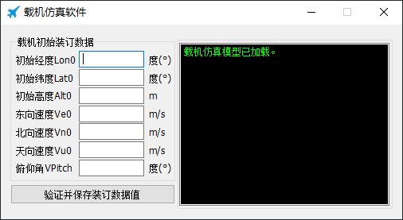
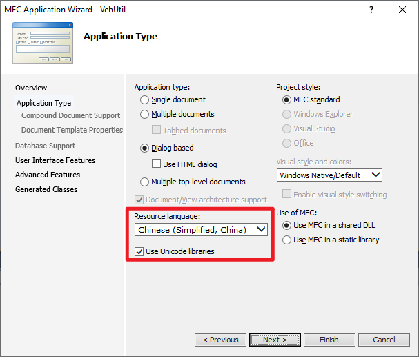

国际化：实现多国语言界面
=============================

《MFC程序国际化：实现多国语言界面》

前言
------

写作目的
~~~~~~~~~~

本文旨在演示如何为 MFC 程序增加多国语言界面。某产品从国内使用转为外贸出口，为此产品开发的上位机软件采用的是简体中文界面，现在需要对上位机软件进行改造，增加英文等多国语言界面。
为了实现这一需求，本人编写了一个演示程序（见 :numref:`演示程序` :ref:`label-section-demoutil` ），通过为这个演示程序增加多国语言界面来探讨 MFC 程序的国际化技术。

.. _label-section-demoutil:

演示程序
~~~~~~~~~~

本文配套的演示程序采用递进的方式逐渐增加多国语言界面及相关功能。演示程序的各个版本如 :numref:`table_mfcmul_DemoUtilVersionsTable` 所示。通过下载链接可得到演示程序的源代码、VS2010工程文件和编译后的可执行程序。

.. list-table:: 演示程序的各个版本
   :name: table_mfcmul_DemoUtilVersionsTable
   :widths: 10 18 18
   :header-rows: 1
   :align: center

   * - 版本号
     - 下载链接
     - 说明
   * - 0.2.0.0
     - :download:`下载：Multilingual_v0.2.0.0.zip <./Resource/Demos/Multilingual_v0.2.0.0.zip>`
     - 初始版本
   * - 0.2.0.1
     - :download:`下载：Multilingual_v0.2.0.1.zip <./Resource/Demos/Multilingual_v0.2.0.1.zip>`
     - 小改动
   * - 0.2.0.2
     - :download:`下载：Multilingual_v0.2.0.2.zip <./Resource/Demos/Multilingual_v0.2.0.2.zip>`
     - 增加多国语言显示界面
   * - 0.2.0.3
     - :download:`下载：Multilingual_v0.2.0.3.zip <./Resource/Demos/Multilingual_v0.2.0.3.zip>`
     - 增加界面显示语言选择对话框

演示程序的初始版本仅包括一个中文界面，如 :numref:`fig_mfcmul_DisplayUI_InitVersion` 所示。

    演示程序（初始版本）显示界面

为了方便公司同事，演示程序采用 Visual C++ 2010 (VC++ 10.0) 开发。项目的字符集设置为Unicode，以避免界面上的文字在非同族语言环境中被显示为乱码，这一点非常重要。

注：在创建演示程序的时候，在MFC应用程序向导中，将资源语言设置（Resource language）设置为简体中文（Chinese (Simplified, China)），如 :numref:`fig_mfcmul_CreateMfcApp_ChooseResourceLanguage` 所示。

    演示程序资源语言设置

下面通过对演示程序的初始版本（版本号：0.2.0.0）进行修改演示如何实现多国语言界面。

实现多国语言界面
------------------

增加窗体的多国语言版本
~~~~~~~~~~~~~~~~~~~~~~~~

本节基于演示程序的 0.2.0.1 版进行修改，修改完后成为了 0.2.0.2 版。

操作：增加多国语言界面
^^^^^^^^^^^^^^^^^^^^^^^^

