国际化：实现多国语言界面
=============================

《MFC程序国际化：实现多国语言界面》

前言
------

写作目的
~~~~~~~~~~

本文旨在演示如何为 MFC 程序增加多国语言界面。某产品从国内使用转为外贸出口，为此产品开发的上位机软件采用的是简体中文界面，现在需要对上位机软件进行改造，增加英文等多国语言界面。
为了实现这一需求，本人编写了一个演示程序（见 :numref:`演示程序` :ref:`label-section-demoutil` ），通过为这个演示程序增加多国语言界面来探讨 MFC 程序的国际化技术。

.. _label-section-demoutil:

演示程序
~~~~~~~~~~

本文配套的演示程序采用递进的方式逐渐增加多国语言界面及相关功能。演示程序的各个版本如 :numref:`table_mfcmul_DemoUtilVersionsTable` 所示。通过下载链接可得到演示程序的源代码、VS2010工程文件和编译后的可执行程序。

.. list-table:: 演示程序的各个版本
   :name: table_mfcmul_DemoUtilVersionsTable
   :widths: 10 18 18
   :header-rows: 1
   :align: center

   * - 版本号
     - 下载链接
     - 说明
   * - 0.2.0.0
     - :download:`下载：Multilingual_v0.2.0.0.zip <./Resource/Demos/Multilingual_v0.2.0.0.zip>`
     - 初始版本
   * - 0.2.0.1
     - :download:`下载：Multilingual_v0.2.0.1.zip <./Resource/Demos/Multilingual_v0.2.0.1.zip>`
     - 小改动
   * - 0.2.0.2
     - :download:`下载：Multilingual_v0.2.0.2.zip <./Resource/Demos/Multilingual_v0.2.0.2.zip>`
     - 增加多国语言显示界面
   * - 0.2.0.3
     - :download:`下载：Multilingual_v0.2.0.3.zip <./Resource/Demos/Multilingual_v0.2.0.3.zip>`
     - 增加界面显示语言选择对话框

演示程序的初始版本仅包括一个中文界面，如 :numref:`fig_mfcmul_DisplayUI_InitVersion` 所示。

.. figure:: Resource/images/Snipaste_2026-09-09_14-06-41.png
    :name: fig_mfcmul_DisplayUI_InitVersion
    :align: center

    演示程序（初始版本）显示界面

为了方便公司同事，演示程序采用 Visual C++ 2010 (VC++ 10.0) 开发。项目的字符集设置为Unicode，以避免界面上的文字在非同族语言环境中被显示为乱码，这一点非常重要。

注：在创建演示程序的时候，在MFC应用程序向导中，将资源语言设置（Resource language）设置为简体中文（Chinese (Simplified, China)），如 :numref:`fig_mfcmul_CreateMfcApp_ChooseResourceLanguage` 所示。

.. figure:: Resource/images/Snipaste_2026-08-13_16-45-05.png
    :name: fig_mfcmul_CreateMfcApp_ChooseResourceLanguage
    :align: center

    演示程序资源语言设置

下面通过对演示程序进行修改演示如何实现多国语言界面。

实现多国语言界面
------------------

增加窗体的多国语言版本
~~~~~~~~~~~~~~~~~~~~~~~~

本节基于演示程序的 0.2.0.1 版进行修改，修改完后成为了 0.2.0.2 版。

.. _label-section-opt-create-multilingual-maindialog:

操作：增加多国语言界面
^^^^^^^^^^^^^^^^^^^^^^^^

【操作步骤1】在 MFC 应用程序 VehUtil 的资源视图（Resource View）中，选择对话框窗体 IDD_VEHUTIL_DIALOG（即程序主窗体），点击鼠标右键在弹出的上下文菜单中选择：Insert Copy，如 :numref:`fig_mfcmul_v0.2.0.1_S1_InsertCopy` 所示。

.. figure:: Resource/images/Snipaste_2026-08-14_12-24-55.png
    :name: fig_mfcmul_v0.2.0.1_S1_InsertCopy
    :align: center

    在上下文菜单中选择：Insert Copy

【操作步骤2】选择资源语言设置为：English (United States)，如 :numref:`fig_mfcmul_v0.2.0.1_S2_ChooseENU` 所示。

.. figure:: Resource/images/Snipaste_2026-08-14_12-25-36.png
    :name: fig_mfcmul_v0.2.0.1_S2_ChooseENU
    :align: center

    选择资源副本的语言设置为：English (United States)

进行这一步操作之后会看到在 MFC 应用程序的资源视图（Resource View）中，多了一个对话框窗体，其 ID 也是 IDD_VEHUTIL_DIALOG。

【操作步骤3】继续选择程序主窗体 IDD_VEHUTIL_DIALOG，点击鼠标右键在弹出的上下文菜单中选择：Insert Copy，如 :numref:`fig_mfcmul_v0.2.0.1_S3_InsertCopy` 所示。

.. figure:: Resource/images/Snipaste_2026-08-14_12-26-21.png
    :name: fig_mfcmul_v0.2.0.1_S3_InsertCopy
    :align: center

    在上下文菜单中选择：Insert Copy

【操作步骤4】选择资源语言设置为：Japanese (Japan)，如 :numref:`fig_mfcmul_v0.2.0.1_S4_ChooseJPN` 所示。

.. figure:: Resource/images/Snipaste_2026-08-14_12-27-01.png
    :name: fig_mfcmul_v0.2.0.1_S4_ChooseJPN
    :align: center

    选择资源副本的语言设置为：Japanese (Japan)

【观察验证1】如 :numref:`fig_mfcmul_v0.2.0.1_V1_Have3MainDialogWinForms` 所示，此时，可以看到在资源视图（Resource View）中，一共有 3 个 ID 为 IDD_VEHUTIL_DIALOG 的对话框窗体，它们分别关联了不同的资源语言设置：简体中文、英语、日语。

注：当资源关联的语言为 English (United States) 时，在资源视图的树状列表中，只显示它的 ID；其它情况下，在资源视图的树状列表中，会显示它的 ID 和所关联的语言设置。

.. figure:: Resource/images/Snipaste_2026-08-14_12-27-21.png
    :name: fig_mfcmul_v0.2.0.1_V1_Have3MainDialogWinForms
    :align: center

    观察：资源视图中有 3 个 ID 为 IDD_VEHUTIL_DIALOG 的对话框窗体

【观察验证2】如 :numref:`fig_mfcmul_v0.2.0.1_V2_3MainDialogsLangPropt` 所示，在资源视图的树状列表中，通过鼠标左键点击选择 ID 为 IDD_VEHUTIL_DIALOG 的所有对话框窗体，在属性列表中可以看到它们所关联的语言设置。

.. figure:: Resource/images/Snipaste_2026-09-10_11-47-44_Combine.png
    :name: fig_mfcmul_v0.2.0.1_V2_3MainDialogsLangPropt
    :align: center

    观察：在属性列表中可以看到对话框窗体所关联的语言设置

【观察验证3】如 :numref:`fig_mfcmul_v0.2.0.1_V3_CompareCodeChange` 所示，通过 Beyond Compare 等工具软件观察截至到目前为止，演示程序的源代码相比 0.2.0.1 版源代码都进行了哪些修改。注意到以下情况：

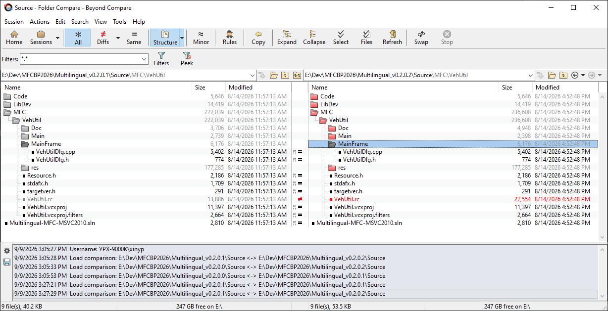

    观察：通过 Beyond Compare 比较源代码的变更

#. Source/MFC/VehUtil/Resource.h 没有任何变化。这说明在对话框窗体 IDD_VEHUTIL_DIALOG（即程序主窗体）多次执行 Insert Copy 的过程中，生成的窗体副本里面的控件全都重用了原始版本中控件的 ID。
#. Source/MFC/VehUtil/VehUtil.rc 在这个文件里，对话框窗体 IDD_VEHUTIL_DIALOG（即程序主窗体）的定义被复制成了 3 份，分别与简体中文、英语、日语这 3 种语言设置相关联。

思考：由于在各个副本中，控件的 ID 并未发生变化，因此，MFC 应用程序原先对控件的所有操作，在各个副本中都仍然有效。

调整多国语言界面
^^^^^^^^^^^^^^^^^^^^

有界面编程经验的小伙伴肯定知道，在文字和控件比较密集的显示界面上，哪怕只是修改了字体，控件布局可能都要重新调整，更不要说换了一种界面显示语言了。

在 :numref:`操作：增加多国语言界面` :ref:`label-section-opt-create-multilingual-maindialog` 中，为演示程序创建了简体中文、英文和日文这 3 个不同显示语言的程序主窗体（对话框窗体），接下来，分别对这 3 个对话框窗体进行调整，使其控件布局合理。

如 :numref:`fig_mfcmul_v0.2.0.1_S5_UI_Adjust_CHN` 所示，简体中文显示界面保持不变。

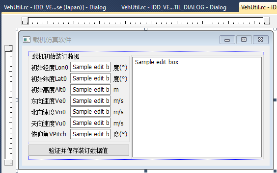

    简体中文显示界面

如 :numref:`fig_mfcmul_v0.2.0.1_S5_UI_Adjust_JPN` 所示，日文显示界面跟中文显示界面最接近，但是 label 文字也略有变长，所以将文字输入框整体右移。

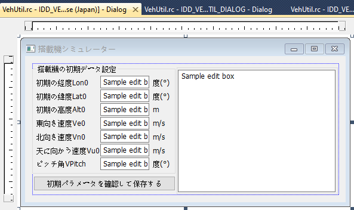

    日文显示界面

如 :numref:`fig_mfcmul_v0.2.0.1_S5_UI_Adjust_ENU` 所示，英文显示界面的 label 文字变得很长，文字输入框右移得更远，而且还分割出来了靠右显示的参数名显示 Label。

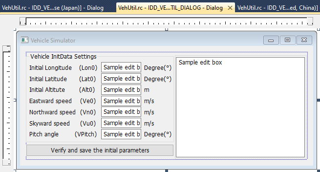

    英文显示界面

对上述不同显示语言的界面分别作了调整，使它们各自都达到了合理的控件布局效果，并且将对话框的标题（Caption）也修改为对应的语言。

总结：

#. 各个不同显示语言的界面副本，可以分别进行调整，调整它们中的一个副本，不会影响到其它的副本。
#. 创建（复制）并调整多国语言显示界面的最佳时机，应该是在初始版本的界面设计完毕之后进行，这样通常能够使多语言副本的调整工作量最小。
#. 如果在复制出多国语言界面副本之后才想起来还要在界面上新增一个（非匿名的）控件，那么此时就不得不在各个语种的界面上都增加这个控件并且使用同一 ID，这样才能使程序控制各个语种的界面时保持行为一致。

运行多国语言界面
^^^^^^^^^^^^^^^^^^^^

下面探讨如何运行指定语种的显示界面。

在 MSDN 上可以查阅到，只需要在程序主窗体创建前，调用 `SetThreadUILanguage <https://learn.microsoft.com/en-us/windows/win32/api/winnls/nf-winnls-setthreaduilanguage>`_ 函数，即可设置当前线程的用户界面语言。这个函数的原型如下所示：

.. code-block:: c++

    LANGID SetThreadUILanguage(
        [in] LANGID LangId
    );

LANGID 这种数据类型，实际上就是 uint16_t。如何给出我们期望的 LangId 呢？我们当然可以直接采用相应的数值。LangId 可以采用的数值如 :numref:`table_mfcmul_LangIdValuesTable` 所示。

.. list-table:: 语言标识符列表
   :name: table_mfcmul_LangIdValuesTable
   :widths: 10 18
   :header-rows: 1
   :align: center

   * - LangId
     - 含义
   * - 1024 (0x0400)
     - 用户默认语言及区域设置
   * - 2052 (0x0804)
     - 简体中文
   * - 1033 (0x0409)
     - 英语（美国）
   * - 1041 (0x0411)
     - 日语（日本）

也可以用 MAKELCID 宏定义来生成 LangId，如 :numref:`table_mfcmul_LangIdMacrosTable` 所示。

.. list-table:: 生成语言标识符的宏
   :name: table_mfcmul_LangIdMacrosTable
   :widths: 2 18
   :header-rows: 1
   :align: center

   * - LangId
     - 宏定义
   * - 1024
     - LANG_USER_DEFAULT
   * - 2052
     - MAKELCID(MAKELANGID(LANG_CHINESE, SUBLANG_CHINESE_SIMPLIFIED), SORT_DEFAULT)
   * - 1033
     - MAKELCID(MAKELANGID(LANG_ENGLISH, SUBLANG_ENGLISH_US), SORT_DEFAULT)
   * - 1041
     - MAKELCID(MAKELANGID(LANG_JAPANESE, SUBLANG_JAPANESE_JAPAN), SORT_DEFAULT)

【实验1】在源代码 Source/MFC/VehUtil/Main/VehUtil.cpp 文件，函数 BOOL CVehUtilApp::InitInstance() 中，对话框窗体 CVehUtilDlg 创建并打开之前，插入以下代码，将当前线程的用户界面语言设置为简体中文：

.. code-block:: c++

    SetThreadUILanguage(MAKELCID(MAKELANGID(LANG_CHINESE, SUBLANG_CHINESE_SIMPLIFIED), SORT_DEFAULT));

运行程序，可以观察到程序主界面的显示语言是简体中文，如 :numref:`fig_mfcmul_v0.2.0.1_S6_UI_Run_CHN` 所示。

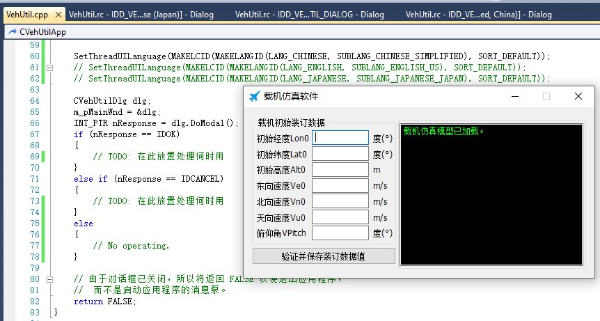

    运行简体中文显示界面

【实验2】将插入的那行代码换成：

.. code-block:: c++

    SetThreadUILanguage(MAKELCID(MAKELANGID(LANG_ENGLISH, SUBLANG_ENGLISH_US), SORT_DEFAULT));

运行程序，可以观察到程序主界面的显示语言是英文，如 :numref:`fig_mfcmul_v0.2.0.1_S6_UI_Run_ENU` 所示。

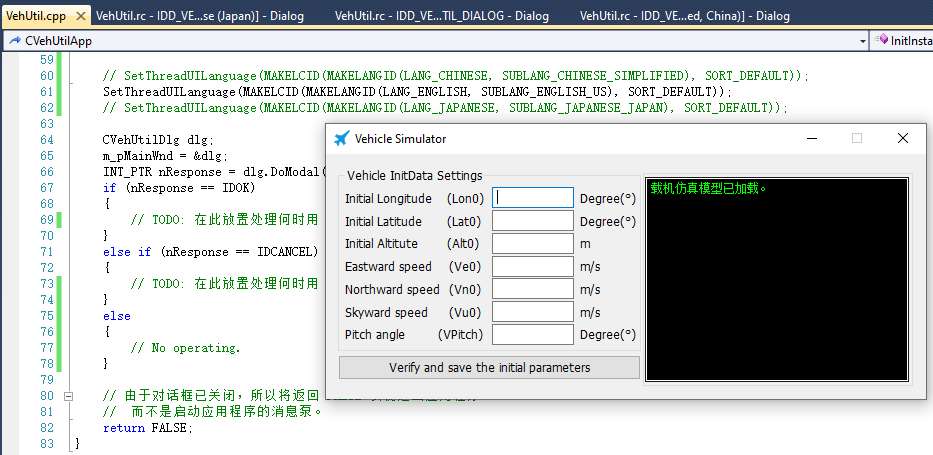

    运行英文显示界面

【实验3】将插入的那行代码换成：

.. code-block:: c++

    SetThreadUILanguage(MAKELCID(MAKELANGID(LANG_JAPANESE, SUBLANG_JAPANESE_JAPAN), SORT_DEFAULT));

运行程序，可以观察到程序主界面的显示语言是日文，如 :numref:`fig_mfcmul_v0.2.0.1_S6_UI_Run_JPN` 所示。

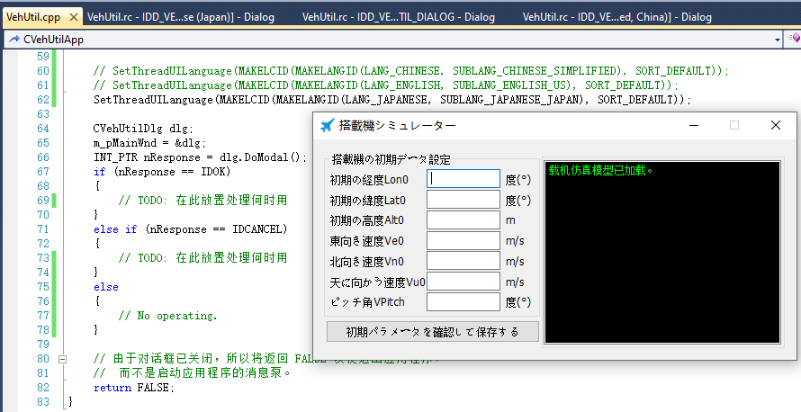

    运行日文显示界面

现在我们将【实验1】、【实验2】和【实验3】中插入的代码都删掉，因为接下来要改成正式的界面切换代码了。

切换界面显示语言
^^^^^^^^^^^^^^^^^^^^

我们打算把用户的显示语言设置存放到程序配置中去，用户可以修改这个配置。程序每次启动时会读取这个配置并设置当前线程的用户界面语言。

程序的配置可以存放在 .ini 文件里，也可存放在注册表中。本文采用后者，用注册表来存放程序的配置。将中插入的代码改为以下代码：

.. code-block:: c++
    
    SetRegistryKey(_T("iSpace\\Defense\\BeijingGroup"));
    
    UINT langId = GetProfileInt(_T("AppSettings"), _T("UIDispLangId"), 0);
    if (langId == 0)
    {
        WriteProfileInt(_T("AppSettings"), _T("UIDispLangId"), LANG_USER_DEFAULT);
        langId = GetProfileInt(_T("AppSettings"), _T("UIDispLangId"), 0);
    }

    SetThreadUILanguage(langId);

上述代码的作用是：程序启动时，读取注册表的 AppSettings/UIDispLangId 键值，如果该键值不存在（返回为0），则创建并写入 1024 (LANG_USER_DEFAULT) 这个数值。这个键值用作 SetThreadUILanguage 函数的 langId 输入参数，从而实现设置当前线程的用户界面语言。

进行这部分代码修改之后，可以尝试手动把这个注册表键值修改为 1024、2052、1033和1041这些数值，观察程序启动后界面的显示语言。

字符串显示的国际化（多国语言显示）
^^^^^^^^^^^^^^^^^^^^^^^^^^^^^^^^^^^^^^^^

在 :numref:`运行多国语言界面` 中，从【实验1】、【实验2】和【实验3】中的 :numref:`fig_mfcmul_v0.2.0.1_S6_UI_Run_CHN` 、:numref:`fig_mfcmul_v0.2.0.1_S6_UI_Run_ENU` 、 :numref:`fig_mfcmul_v0.2.0.1_S6_UI_Run_JPN` 运行截图中可以看到，虽然窗体上的控件能够按照多国语言进行显示，但右侧编辑控件中显示的“载机仿真模型已加载。”这几个字始终是简体中文的。能否让这个编辑控件中显示的内容也实现国际化（多国语言显示）呢？本节我们就来解决这个问题。

固定字符串的国际化显示
""""""""""""""""""""""""""""""""""""""

【操作步骤1】在 MFC 资源的 String Table 中，新增一条定义：IDS_CUSTMSG_VEHSIM_MODEL_LOADED，如 :numref:`fig_mfcmul_v0.2.0.1_S7_STRTAB_1` 所示。

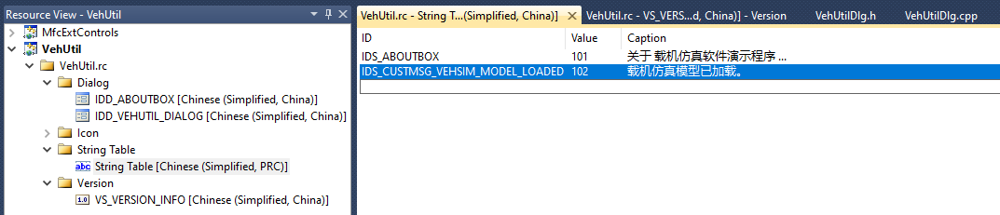

    新增字符串的定义

“载机仿真模型已加载。”原来的程序源代码如 :numref:`fig_mfcmul_v0.2.0.1_S7_STRTAB_2` 所示，我们进行修改，如 :numref:`fig_mfcmul_v0.2.0.1_S7_STRTAB_3` 所示。

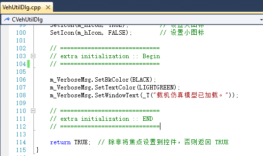

    采用硬编码（Hardcode）的方式显示字符串

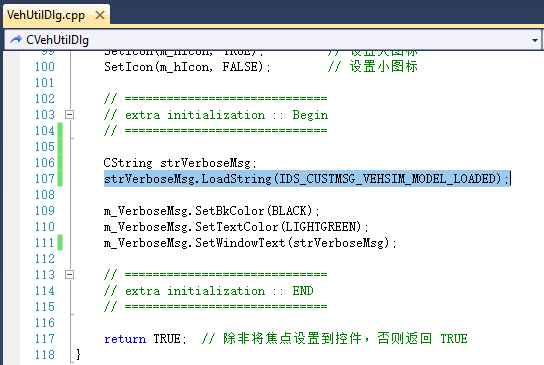

    采用 String Table 中的定义显示字符串

【操作步骤2】我们把 String Table 通过 Insert Copy 的方式复制出英文、日文的副本，并修改英文、日文副本的文字内容为相应的语种，如 :numref:`fig_mfcmul_v0.2.0.1_S8_STRTAB_4` 所示。

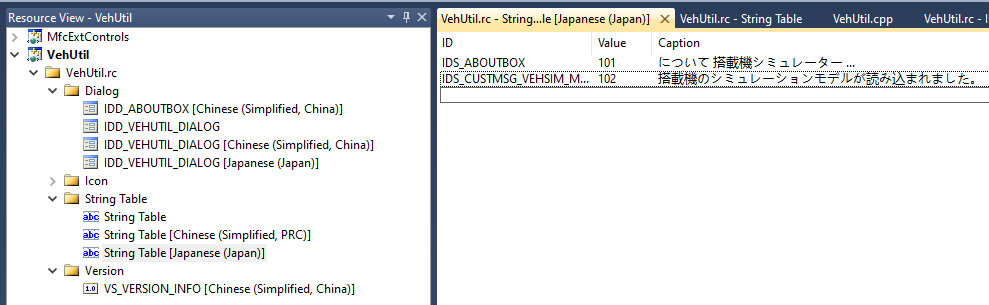

    创建和修改 IDS_CUSTMSG_VEHSIM_MODEL_LOADED 的不同语种的定义

