
提高MFC程序的兼容性
===================

如果只关心结论，请看：:numref:`结论和建议` :ref:`label-section-conclusion` 。

前言
----

当我们选择用 MFC 开发应用程序时，其中一个重要的技术考虑就是其强大的操作系统兼容性。MFC 是微软对 Win32 API 的浅封装，这造成了 MFC 的使用难度比较高、开发效率低的同时，也成就了 MFC 在工控领域强大的操作系统兼容性。在一些“古老”且不便升级的工业系统中，在一些运行着 Windows 7、Windows CE、Windows 98 的主机上，那些非常“fashion”的 Electron、.Net、Qt 等界面开发技术不一定有用武之地，但是 MFC 却能游刃有余地施展拳脚。另外，20多年前，你用 VC6 为 Windows XP 开发的 MFC 程序，今天很可能在最新的 Windows 11 操作系统上不加任何修改直接运行，不需要依赖任何额外安装的软件库。这是 MFC 直到今天依然存在的原因之一。

但是，我们也经常遇到一些人写的程序，在他本人的电脑上运行一切正常，换一台电脑却无法启动。本文写作的目的就是帮助开发者解决这类问题。

本行业桌面操作系统应用情况
~~~~~~~~~~~~~~~~~~~~~~~~~~

MFC 程序兼容 Windows XP、Windows Server 2003 及更早的操作系统，那是另外一个话题 [#f1]_ 。迄今为止我只遇到过一次需要兼容 Windows XP 的情况，那是有明确的资金支持的。在本行业（航天及军工行业）中，目前 [#f2]_ 需要兼容的最早的操作系统通常为 Windows 7，而且通常是打了 Service Pack 1 的 Professional/Ultimate 64位版本。目前 [#f2]_ 本行业最经常使用的桌面操作系统是Windows 10，Windows 11 用得很少。

本文的目标
~~~~~~~~~~

本文重点解决 MFC 程序在 Windows 7 操作系统中运行的问题。Windows 7 以后的操作系统如 Windows 10、11，在日常工作中已经被充分地验证过，本文打算直接引用日常经验而暂不展开验证。Windows 7 以前的操作系统，如果遇到兼容这些系统的需求我们再另行论述。

准备验证环境
~~~~~~~~~~~~

开发环境
^^^^^^^^

本文采用 Visual Studio 2026 在 Windows 10 操作系统上开发示例程序。

很多人误以为必须使用老版本的 Visual Studio 来开发 MFC 程序以保证程序能在 Windows 7 上运行，为了破除这个观点，本文特地采用当前 [#f2]_ 最新版本的 VS：Visual Studio 2026，在写这篇文章之前，我特意把 Visual Studio 2026 升级到了最新版：18.1.1，如 :numref:`fig_osc_VS2026Version` 所示。

.. figure:: Resource/Images/Snipaste_2026-01-08_18-58-58.png
    :name: fig_osc_VS2026Version
    :align: center

    Visual Studio 2026 详细版本

.. _label-section-Init-SW-Env:

运行环境
^^^^^^^^^^^^^^^^

本文采用 VirtualBox 安装 Windows 7 虚拟机作为示例程序的运行环境。如 :numref:`fig_osc_PreInstalledSW` 所示，虚拟机安装操作系统后仅安装 Oracle VirtualBox Guest Additions 7.2.4 以便于虚拟机管理和操作，不安装额外的程序。

.. figure:: Resource/Images/Snipaste_2026-01-09_11-36-19.png
    :name: fig_osc_PreInstalledSW
    :align: center

    虚拟机软件环境

为了开展此次验证试验，安装和 Clone 了十几台虚拟机，如 :numref:`fig_osc_VirtualMachines` 所示。

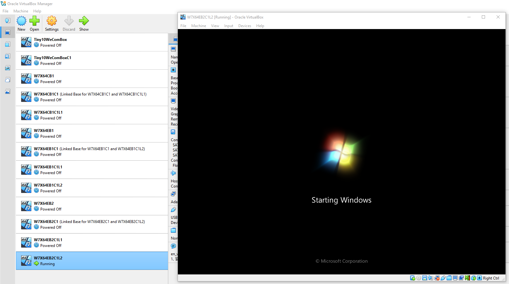

    用于准备 Windows 7 测试环境的 VirtualBox 虚拟机

验证过程
-------------------------------

准备示例程序
~~~~~~~~~~~~~~~~~~~~~~~~~~~~~~

编写一个简单的MFC程序，如 :numref:`fig_osc_MFCProjSDKSel` 所示，在项目属性 Configuration Properties | General 设置中，将 Windows SDK Version 设置为 Windows 10.0 SDK (Latest)。

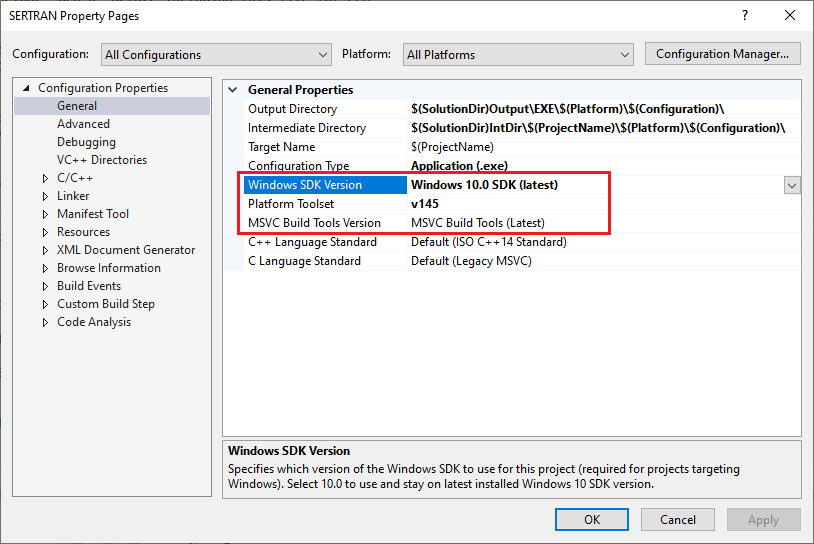

    SDK版本选择

#. Windows SDK Version：选择最新的 Windows 10.0 SDK (Latest)。这其实也是默认选项。
#. Platform Toolset：保持默认选项即可。
#. MSVC Build Tool Version：保持默认选项即可。

注意：尽管我们的目标是希望程序能够运行在 Windows 7、10、11 上，但是 Windows SDK Version 我们设置为最新的 Windows 10 SDK，会有人担心此处如何保证程序兼容 Windows 7 运行环境吗？相关的解释见微软 `Visual C++ 团队 <https://devblogs.microsoft.com/cppblog/author/vcblog/>`_ 的 Pat Brenner 撰写的文章： `Setting WINVER for MFC Applications <https://devblogs.microsoft.com/cppblog/setting-winver-for-mfc-applications/>`_。

程序界面如 :numref:`fig_osc_MFCUtilDemo` 所示。

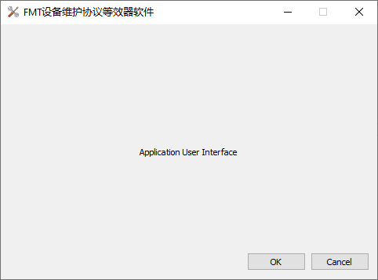

    MFC示例程序界面

按照不同的编译选项，编译出2个不同的版本，一个版本在静态库中使用 MFC 类库，另一个版本在共享动态链接库中使用 MFC 类库。

.. _label-section-DevUtil-StaticMFC:

示例程序：在静态库中使用 MFC 类库
^^^^^^^^^^^^^^^^^^^^^^^^^^^^^^^^^^^^^^^^^^^^^^

如 :numref:`fig_osc_MFCUtil_Use_StaticMFC` 所示，将项目属性的 `Configuration` 保持为 `All Configurations` 不变，`Platform` 选项保持为 `All Platforms` 不变，在项目属性 Configuration Properties | Advanced 设置中，将 `Use of MFC` 设置为 `Use MFC in a Static Library`。

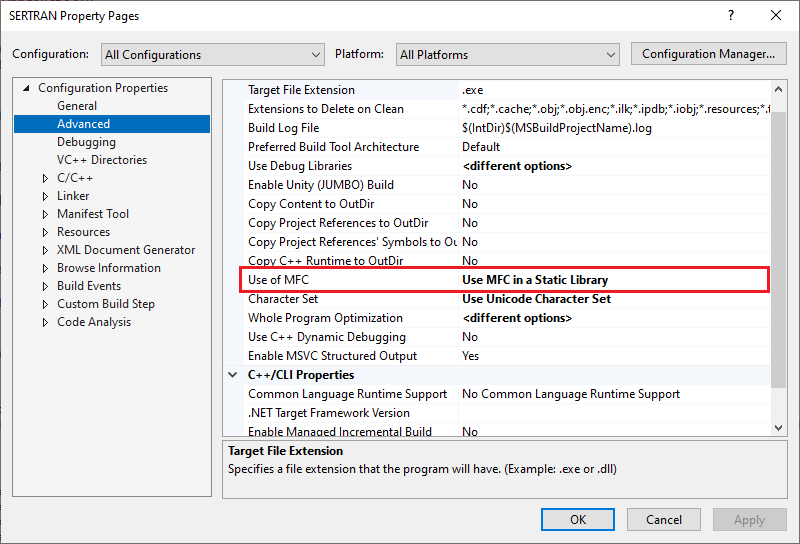

    编译选项：在静态库中使用 MFC 类库

如 :numref:`fig_osc_StaticMFC_Debug_MTd` 所示，将项目属性的 `Configuration` 选项设置为 `Debug`，`Platform` 选项保持为 `All Platforms` 不变，在项目属性 Configuration Properties | C/C++ | Code Generation 设置中，将 `Runtime Library` 设置为 `Multi-threaded Debug (/MTd)`。

.. figure:: Resource/Images/Snipaste_2026-01-09_14-59-56.png
    :name: fig_osc_StaticMFC_Debug_MTd
    :align: center

    编译选项：设置在 Debug 模式下运行库为 /MTd

如 :numref:`fig_osc_StaticMFC_Release_MT` 所示，将项目属性的 `Configuration` 选项设置为 `Release`，`Platform` 选项保持为 `All Platforms` 不变，在项目属性 Configuration Properties | C/C++ | Code Generation 设置中，将 `Runtime Library` 设置为 `Multi-threaded (/MT)`。

.. figure:: Resource/Images/Snipaste_2026-01-09_15-21-30.png
    :name: fig_osc_StaticMFC_Release_MT
    :align: center

    编译选项：设置在 Release 模式下运行库为 /MT

如 :numref:`fig_osc_MFCUtil_StaticMFC_BuildOut` 所示，分别编译出程序的64位 Debug 版和 Release 版出来，保存在共享文件夹 `StaticMFC` 里面，供后续验证过程使用。

.. figure:: Resource/Images/Snipaste_2026-01-09_15-28-19.png
    :name: fig_osc_MFCUtil_StaticMFC_BuildOut
    :align: center

    分别编译出程序的64位 Debug 版和 Release 版

:download:`下载本示例（源代码、VS2026工程文件，64位 Debug 版和 Release 版可执行程序） <./Resource/Demos/osc/StaticMFC.zip>`

.. _label-section-DevUtil-SharedMFC:

示例程序：在共享动态链接库中使用 MFC 类库
^^^^^^^^^^^^^^^^^^^^^^^^^^^^^^^^^^^^^^^^^^^^^^

如 :numref:`fig_osc_MFCUtil_Use_SharedMFC` 所示，将项目属性的 `Configuration` 选项设置为 `All Configurations`，`Platform` 选项保持为 `All Platforms` 不变，在项目属性 Configuration Properties | Advanced 设置中，将 `Use of MFC` 设置为 `Use MFC in a Shared DLL`。

.. figure:: Resource/Images/Snipaste_2026-01-09_15-34-11.png
    :name: fig_osc_MFCUtil_Use_SharedMFC
    :align: center

    编译选项：在共享动态链接库中使用 MFC 类库

如 :numref:`fig_osc_SharedMFC_Debug_MDd` 所示，将项目属性的 `Configuration` 选项设置为 `Debug`，`Platform` 选项保持为 `All Platforms` 不变，在项目属性 Configuration Properties | C/C++ | Code Generation 设置中，将 `Runtime Library` 设置为 `Multi-threaded Debug DLL (/MDd)`。

.. figure:: Resource/Images/Snipaste_2026-01-09_16-08-01.png
    :name: fig_osc_SharedMFC_Debug_MDd
    :align: center

    编译选项：设置在 Debug 模式下运行库为 /MDd

如 :numref:`fig_osc_SharedMFC_Release_MD` 所示，将项目属性的 `Configuration` 选项设置为 `Release`，`Platform` 选项保持为 `All Platforms` 不变，在项目属性 Configuration Properties | C/C++ | Code Generation 设置中，将 `Runtime Library` 设置为 `Multi-threaded DLL (/MD)`。

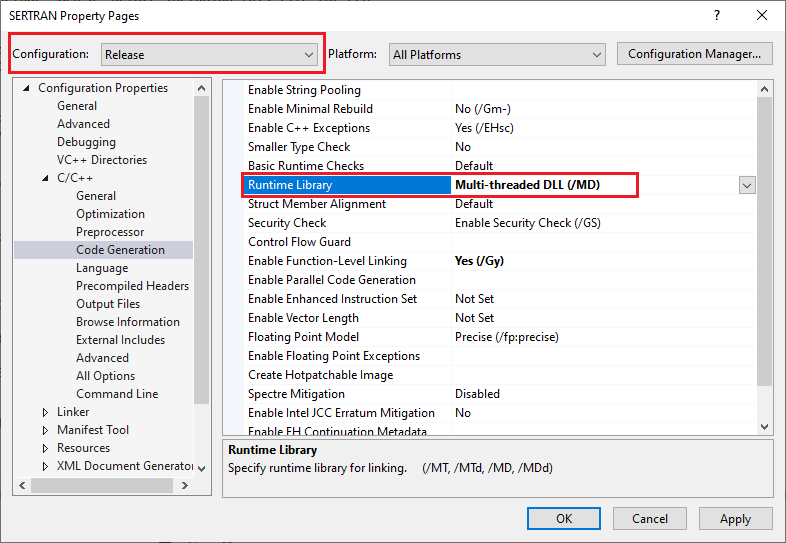

    编译选项：设置在 Release 模式下运行库为 /MD

如 :numref:`fig_osc_MFCUtil_SharedMFC_BuildOut` 所示，分别编译出程序的64位 Debug 版和 Release 版出来，保存在共享文件夹 `SharedMFC` 里面，供后续验证过程使用。

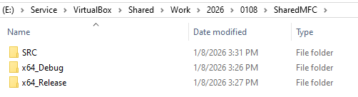

    分别编译出程序的64位 Debug 版和 Release 版

:download:`下载本示例（源代码、VS2026工程文件，64位 Debug 版和 Release 版可执行程序） <./Resource/Demos/osc/SharedMFC.zip>`

比较示例程序的构建方案
^^^^^^^^^^^^^^^^^^^^^^^^^^^^^^^^

我们比较一下，对于同一套 MFC 程序源代码， `在静态库中使用 MFC 类库` 和 `在共享动态链接库中使用 MFC 类库` 这2个不同版本的区别。

首先我们注意到这2个版本编译出的可执行文件，其文件大小存在显著差异，如 :numref:`table_osc_StaticMFC_SharedMFC_EXECompare` 所示。

.. list-table:: 可执行文件大小比较
   :name: table_osc_StaticMFC_SharedMFC_EXECompare
   :widths: 10 18 18
   :header-rows: 1
   :align: center

   * - \
     - 在静态库中使用 MFC 类库
     - 在共享动态链接库中使用 MFC 类库
   * - x64 Release
     - 3.76 MB
     - 46.5 KB
   * - x64 Debug
     - 12.6 MB
     - 219 KB

在 :numref:`table_osc_StaticMFC_SharedMFC_EXECompare` 中，“在静态库中使用 MFC 类库” 这个版本的可执行程序，明显比 “在共享动态链接库中使用 MFC 类库” 这个版本的可执行程序大很多。不难明白其中的原因。

方案对比：在静态库中使用 MFC 类库
""""""""""""""""""""""""""""""""""""""""""""""""

当构建 MFC 程序时选择了在静态库中使用 MFC 类库，MFC 的库函数会被编译并链接到最终的可执行文件中。这意味着最终的程序包含了 MFC 的库代码，因此不需要额外的 MFC 动态链接库文件来运行。

这样做的优点是：

#. 可执行文件独立性强，可以在没有安装MFC DLL文件的机器上运行。
#. 减少了因 MFC 动态链接库文件版本不匹配或缺失而导致的运行时错误。

这样做的缺点是：

#. 可执行文件较大，因为包含了MFC的支持库。
#. 增加了编译时间和内存消耗。

方案对比：在共享动态链接库中使用 MFC 类库
""""""""""""""""""""""""""""""""""""""""""""""""

当构建 MFC 程序时选择了在共享动态链接库中使用 MFC 类库，MFC 的库函数封装在 MFC 的动态链接库文件中，而不是被编译到最终的可执行文件中。程序在运行时动态地加载 MFC 动态链接库文件。

这样做的优点是：

#. 可执行文件较小，因为不包含 MFC 支持库。
#. 减少了内存消耗，因为 MFC 支持库是共享的，应用程序可以共享 MFC 动态链接库文件。

这样做的缺点是：

#. 需要目标机器上安装相应的 MFC 动态链接库文件，否则程序无法正常运行。
#. 可能会遇到 MFC 动态链接库文件版本冲突的问题。

验证在静态库中使用 MFC 类库的操作系统兼容性
~~~~~~~~~~~~~~~~~~~~~~~~~~~~~~~~~~~~~~~~~~~

在虚拟机验证环境中运行 :numref:`示例程序：在静态库中使用 MFC 类库` :ref:`label-section-DevUtil-StaticMFC` 中编译出 Release 版和 Debug 版 MFC 示范程序，验证示范程序是否可以正常启动和运行。

验证环境：Windows 7 Service Pack 1 (验证静态库示范程序)
^^^^^^^^^^^^^^^^^^^^^^^^^^^^^^^^^^^^^^^^^^^^^^^^^^^^^^^

按照 :numref:`运行环境` :ref:`label-section-Init-SW-Env` 准备虚拟机。如 :numref:`fig_osc_TestBox_Win7SP1ENU` 所示，在 64 位英文版 Windows 7 Service Pack 1 虚拟机上验证示范程序是否可以正常启动和运行。

.. figure:: Resource/Images/Snipaste_2026-01-10_17-12-09.png
    :name: fig_osc_TestBox_Win7SP1ENU
    :align: center

    软件环境：Windows 7 Service Pack 1 64位英文版操作系统

如 :numref:`fig_osc_TestBox_Win7SP1_DetailedVer` 所示，运行 ``WinVER`` 命令可以看到操作系统的详细版本： `Version 6.1 (Build 7601)` 。

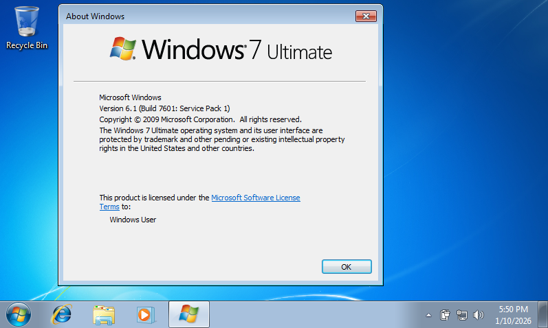

    操作系统的详细版本：Version 6.1 (Build 7601: Service Pack 1)

如 :numref:`fig_osc_Win7SP1ENU_RunStaticReleaseUtil` 所示，Release 版示范程序可以在 Windows 7 Service Pack 1 虚拟机上正常运行。

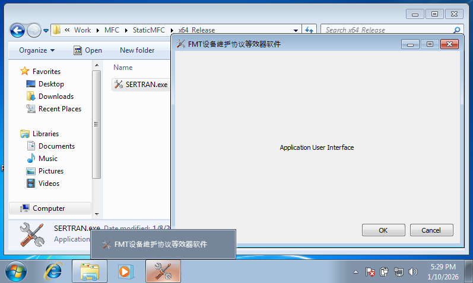

    验证结果：在静态库中使用 MFC 类库的 Release 版程序在Win7SP1 虚拟机上正常运行

如 :numref:`fig_osc_Win7SP1ENU_RunStaticDebugUtil` 所示，Debug 版示范程序可以在 Windows 7 Service Pack 1 虚拟机上正常运行。

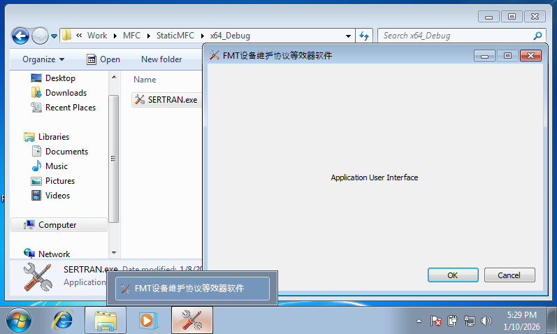

    验证结果：在静态库中使用 MFC 类库的 Debug 版程序在Win7SP1 虚拟机上正常运行

如 :numref:`fig_osc_TestBox_Win7SP1CHS` 所示，操作系统换成简体中文版的 Windows 7 Service Pack 1。

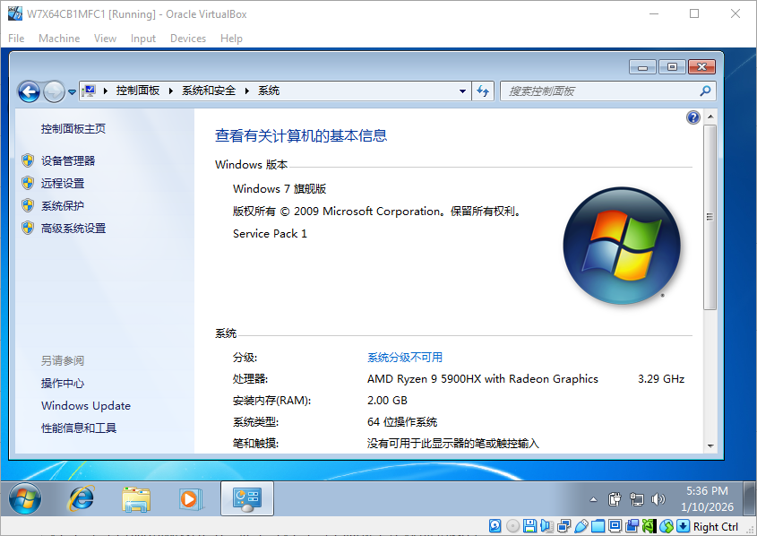

    软件环境：Windows 7 Service Pack 1 64位简体中文版操作系统

如 :numref:`fig_osc_Win7SP1CHS_RunStaticDebugUtil` 所示，Release 版和Debug 版 MFC 示范程序均可在简体中文 Windows 7 Service Pack 1 虚拟机上正常运行，字体显示比英文版看上去要稍微正常一些。

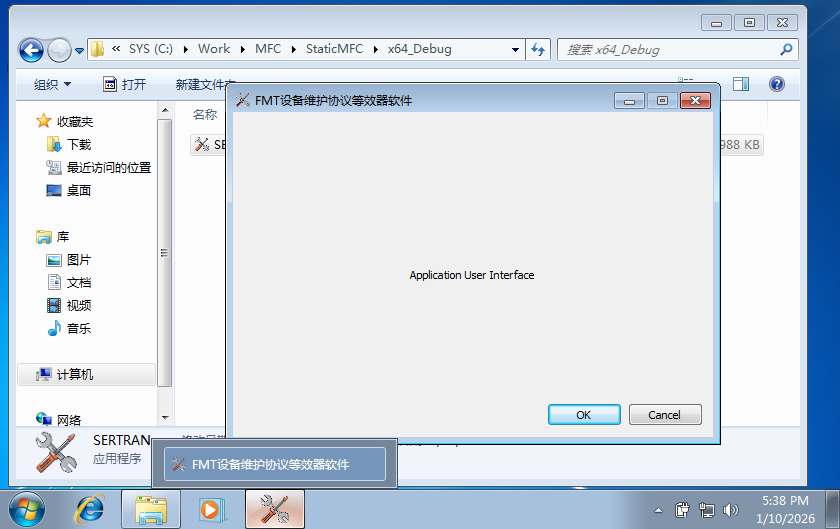

    验证结果：在静态库中使用 MFC 类库的 Debug 版程序在中文 Win7SP1 虚拟机上正常运行

操作系统的语言对验证结果没有影响。下面我们仅在英文版操作系统上进行验证，不再单独验证简体中文版的操作系统。

验证环境：Windows 7 (验证静态库示范程序)
^^^^^^^^^^^^^^^^^^^^^^^^^^^^^^^^^^^^^^^^

按照 :numref:`运行环境` :ref:`label-section-Init-SW-Env` 准备虚拟机。如 :numref:`fig_osc_TestBox_Win7ENU` 所示，在 64 位英文版 Windows 7 虚拟机上验证示范程序是否可以正常启动和运行。

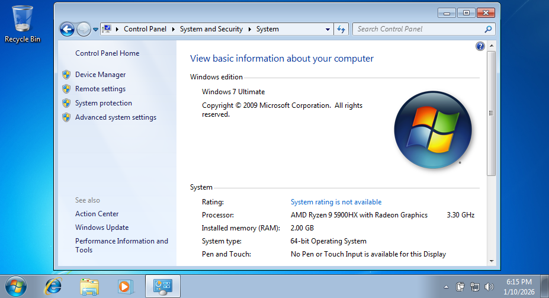

    软件环境：Windows 7 64位英文版操作系统

如 :numref:`fig_osc_TestBox_Win7_DetailedVer` 所示，运行 ``WinVER`` 命令可以看到操作系统的详细版本： `Version 6.1 (Build 7600)` 。

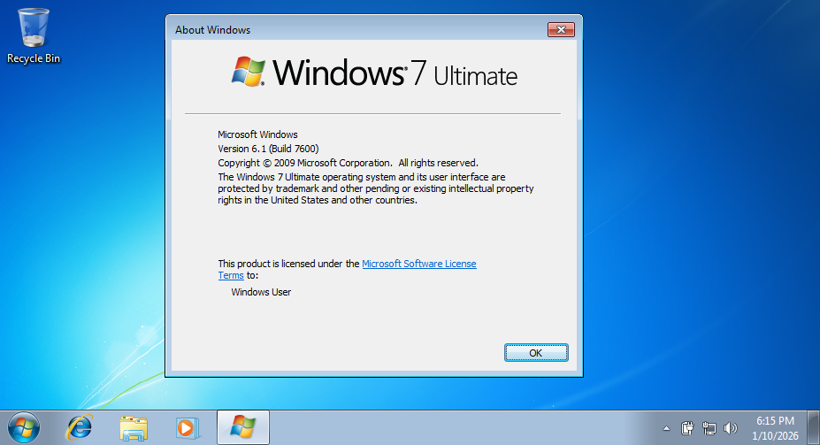

    操作系统的详细版本：Version 6.1 (Build 7600)

如 :numref:`fig_osc_Win7ENU_RunStaticReleaseUtil` 所示，:numref:`示例程序：在静态库中使用 MFC 类库` :ref:`label-section-DevUtil-StaticMFC` 中编译出的 Release 版 MFC 示范程序可以在 Windows 7 虚拟机上正常运行。

.. figure:: Resource/Images/Snipaste_2026-01-10_18-21-35.png
    :name: fig_osc_Win7ENU_RunStaticReleaseUtil
    :align: center

    验证结果：在静态库中使用 MFC 类库的 Release 版程序在 Win7 虚拟机上正常运行

如 :numref:`fig_osc_Win7ENU_RunStaticDebugUtil` 所示，:numref:`示例程序：在静态库中使用 MFC 类库` :ref:`label-section-DevUtil-StaticMFC` 中编译出的 Debug 版 MFC 示范程序可以在 Windows 7 虚拟机上正常运行。

.. figure:: Resource/Images/Snipaste_2026-01-10_18-22-08.png
    :name: fig_osc_Win7ENU_RunStaticDebugUtil
    :align: center

    验证结果：在静态库中使用 MFC 类库的 Debug 版程序在 Win7 虚拟机上正常运行

验证在共享动态链接库中使用 MFC 类库的操作系统兼容性
~~~~~~~~~~~~~~~~~~~~~~~~~~~~~~~~~~~~~~~~~~~~~~~~~~~~

在虚拟机验证环境中运行 :numref:`示例程序：在共享动态链接库中使用 MFC 类库` :ref:`label-section-DevUtil-SharedMFC` 中编译出 Release 版和 Debug 版 MFC 示范程序，验证示范程序是否可以正常启动和运行。

验证环境：Windows 7 Service Pack 1 (验证动态库示范程序)
^^^^^^^^^^^^^^^^^^^^^^^^^^^^^^^^^^^^^^^^^^^^^^^^^^^^^^^

按照 :numref:`运行环境` :ref:`label-section-Init-SW-Env` 准备虚拟机。如 :numref:`fig_osc_TestBox_Win7SP1ENU` 所示，在 64 位英文版 Windows 7 Service Pack 1 虚拟机上验证示范程序是否可以正常启动和运行。

验证 Release 版的 MFC 示范程序
""""""""""""""""""""""""""""""""""""""

.. _label-section-FAIL-Win7SP1-MISS-mfc140u:

程序启动出错：缺少 mfc140u.dll
##########################################

如 :numref:`fig_osc_Win7SP1ENU_RunSharedReleaseUtil_Fail` 所示，Release 版示范程序启动失败，报“缺少 mfc140u.dll”的系统错误信息。

.. figure:: Resource/Images/Snipaste_2026-01-10_18-58-55.png
    :name: fig_osc_Win7SP1ENU_RunSharedReleaseUtil_Fail
    :align: center

    共享动态链接库 Release 版 MFC 示范程序程序在 Win7SP1 虚拟机上运行出错

:numref:`fig_osc_Win7SP1ENU_RunSharedReleaseUtil_Fail` 中的报错信息为：

.. error:: The program can't start because mfc140u.dll is missing from your computer. Try reinstalling the program to fix this problem.

简体中文版 Windows 7 Service Pack 1 虚拟机上，Release 版示范程序启动失败，如 :numref:`fig_osc_Win7SP1CHS_RunSharedReleaseUtil_Fail` 所示。

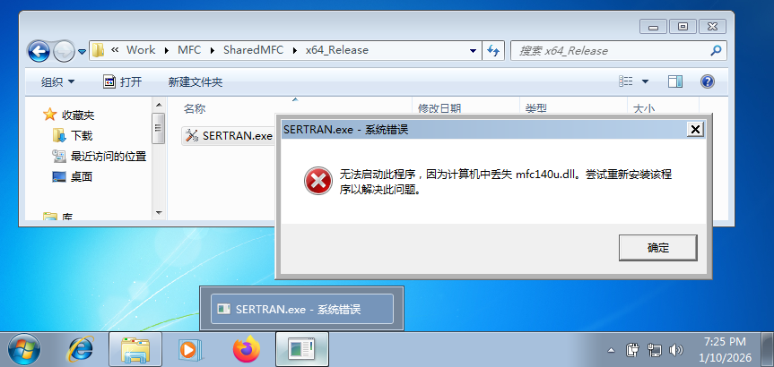

    共享动态链接库 Release 版 MFC 示范程序程序在简体中文版 Win7SP1 虚拟机上运行出错

如 :numref:`fig_osc_Win7SP1CHS_RunSharedReleaseUtil_Fail` 所示，简体中文版的报错信息为：

.. error:: 无法启动此程序，因为计算机中丢失 mfc140u.dll。尝试重新安装该程序以解决此问题。

解决方案：安装 Microsoft Visual C++ Redistributable Package (可再发行程序包)
################################################################################################

关于 Microsoft Visual C++ Redistributable Package (可再发行程序包)，详见 :numref:`关于Microsoft Visual C++ Redistributable Package (可再发行程序包)` :ref:`关于Microsoft Visual C++ Redistributable Package (可再发行程序包)` 。

如 :numref:`fig_osc_Win7SP1ENU_INST_VCREDIST` 所示，安装 Visual C++ Redistributable 2022 17.0 x64 `可再发行程序包` 。

.. figure:: Resource/Images/Snipaste_2026-01-10_23-54-50.png
    :name: fig_osc_Win7SP1ENU_INST_VCREDIST
    :align: center

    安装 Visual C++ Redistributable Package

.. figure:: Resource/Images/Snipaste_2026-01-10_23-55-41.png
    :name: fig_osc_Win7SP1ENU_INST_VCREDIST_DONE
    :align: center

    安装 Visual C++ Redistributable Package 成功

安装 Visual C++ Redistributable 2022 17.0 x64 `可再发行程序包` 正常结束（见 :numref:`fig_osc_Win7SP1ENU_INST_VCREDIST_DONE` ）。再次运行 Release 版示范程序，如 :numref:`fig_osc_Win7SP1ENU_AFTER_VCREDIST_EXEC` 所示，程序正常运行。:numref:`程序启动出错：缺少 mfc140u.dll` :ref:`label-section-FAIL-Win7SP1-MISS-mfc140u` 所述的问题得以解决。

.. figure:: Resource/Images/Snipaste_2026-01-10_23-56-31.png
    :name: fig_osc_Win7SP1ENU_AFTER_VCREDIST_EXEC
    :align: center

    MFC 示范程序正常运行

验证 Debug 版的 MFC 示范程序
""""""""""""""""""""""""""""""""""""""

问题：Microsoft Visual C++ Redistributable Package (可再发行程序包) 不能使 Debug 版示范程序正常运行
###################################################################################################

上述 Windows 7 Service Pack 1 虚拟机在安装 Visual C++ Redistributable 2022 17.0 x64 `可再发行程序包` 之后，虽然可以正常运行 Release 版示范程序，但在运行 Debug 版示范程序时仍然出错，如 :numref:`fig_osc_Win7SP1_AfterVCRedist_DebugUtilFail` 所示。

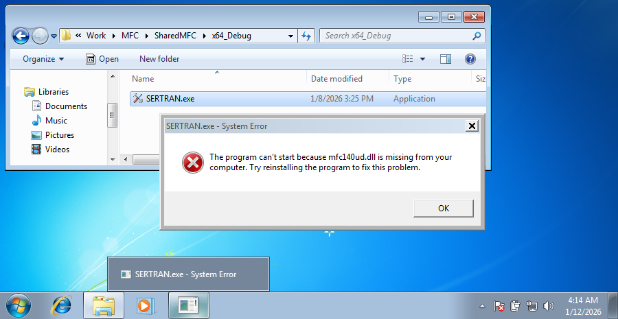

    运行 Debug 版示范程序时启动出错

按照 :numref:`运行环境` :ref:`label-section-Init-SW-Env` 准备一台全新的 Windows 7 Service Pack 1 虚拟机，以寻找 Debug 版示范程序启动失败的解决方案。

程序启动出错：缺少 mfc140ud.dll
##########################################

:numref:`fig_osc_Win7SP1_AfterVCRedist_DebugUtilFail` 中，Debug 版示范程序启动失败，报“缺少 mfc140ud.dll”的系统错误信息。报错信息为：

.. error:: The program can't start because mfc140ud.dll is missing from your computer. Try reinstalling the program to fix this problem.

简体中文版 Windows 7 Service Pack 1 虚拟机上，Debug 版示范程序启动失败，如 :numref:`fig_osc_Win7SP1CHS_RunSharedDebugUtil_Fail` 所示。

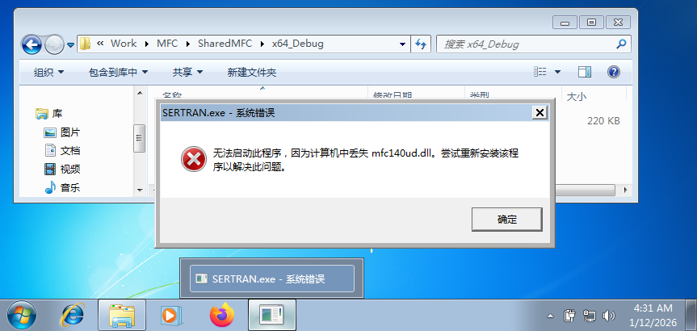

    共享动态链接库 Debug 版 MFC 示范程序程序在简体中文版 Win7SP1 虚拟机上运行出错

如 :numref:`fig_osc_Win7SP1CHS_RunSharedDebugUtil_Fail` 所示，简体中文版的报错信息为：

.. error:: 无法启动此程序，因为计算机中丢失 mfc140ud.dll。尝试重新安装该程序以解决此问题。

对“缺少 mfc140ud.dll”问题的分析和探索
##########################################

熟悉 Win32 API 的朋友一眼便可看出，mfc140ud.dll 是 Debug 版的 MFC Unicode 动态链接库。在解决 :numref:`程序启动出错：缺少 mfc140u.dll` :ref:`label-section-FAIL-Win7SP1-MISS-mfc140u` 中的问题时，我们通过 :numref:`解决方案：安装 Microsoft Visual C++ Redistributable Package (可再发行程序包)` :ref:`解决方案：安装 Microsoft Visual C++ Redistributable Package (可再发行程序包)` 能够解决 Release 版 MFC 程序运行所需的动态链接库，但是却没有解决 Debug 版 MFC 程序运行所需的动态链接库。

在有些技术文章中，是这样建议的：在一台同样操作系统的计算机上，安装 Visual Studio 开发环境进行 MFC 程序开发，作为开发环境。这样，开发环境的系统中就会有运行 MFC 程序所需的全部动态链接库。如果运行环境中缺少哪些动态链接库，就直接从开发环境中拷贝到运行环境中，就能解决 MFC 程序运行时缺少一些动态链接库的问题。

我并不打算采取从开发环境中拷贝动态链接库这个办法，而是在 `dll-files.com <https://www.dll-files.com/>`_ 这个网站上搜索，找到了 mfc140ud.dll 的不同版本，如 :numref:`fig_osc_LookFor_mfc140ud-dll` 所示。

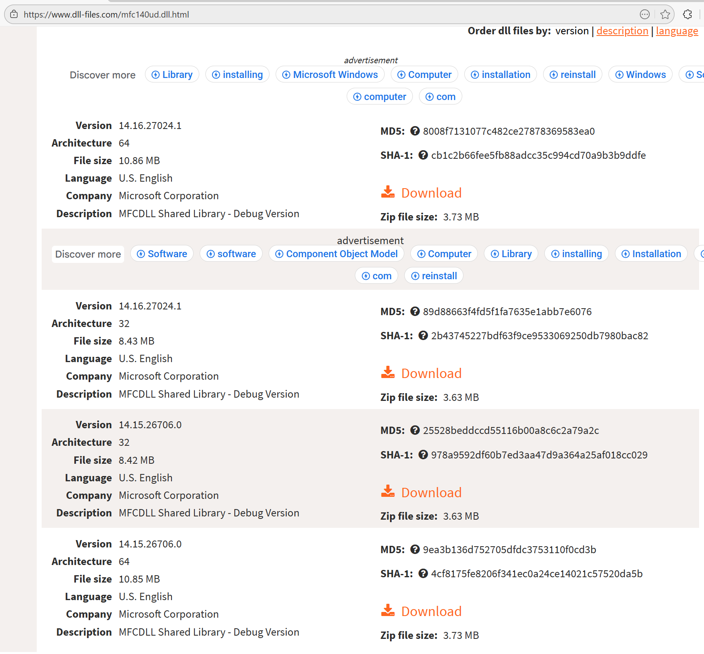

    在 dll-files.com 网站上搜索 mfc140ud.dll 的不同版本

尝试采用上述搜索结果中 64 位最新版本的 mfc140ud.dll，下载并拷贝到运行环境（虚拟机）的 ``C:\Windows\System32`` 目录中。

.. tip:: 需要注意的是，我们将 mfc140ud.dll 拷贝到运行环境的 ``C:\Windows\System32`` 目录，这个路径取决于 Windows 操作系的安装目录。如 :numref:`fig_osc_LookFor_SystemRoot` 所示，运行 ``echo %SystemRoot%`` 命令，可以查看 Windows 操作系的安装目录。

.. figure:: Resource/Images/Snipaste_2026-01-12_04-47-42.png
    :name: fig_osc_LookFor_SystemRoot
    :align: center

    查看%SystemRoot%路径

提醒读者注意，如果 Windows 操作系的安装目录不是 ``C:\Windows`` ，那么， `System32` 的路径应相应的按照实际路径处理。

然后再运行 Debug 版的示范程序，程序依然无法启动，但是系统错误信息变了，如 :numref:`fig_osc_missing_vcruntime140d_dll` 所示：

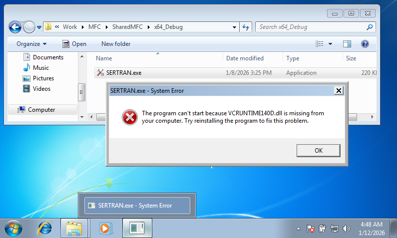

    系统错误信息：缺少 vcruntime140d.dll

:numref:`fig_osc_missing_vcruntime140d_dll` 中的系统错误信息是：

.. error:: The program can't start because VCRUNTIME140D.dll is missing from your computer. Try reinstalling the program to fix this problem.

我们又继续在运行环境中补充了 vcruntime140d.dll、ucrtbased.dll 和 vcruntime140_1d.dll ，然后运行 Debug 版的示范程序。如 :numref:`fig_osc_missing_api_ms_win_xxx` 所示，程序启动依然出错。

.. figure:: Resource/Images/Snipaste_2026-01-12_06-01-25.png
    :name: fig_osc_missing_api_ms_win_xxx
    :align: center

    系统错误信息：缺少更多的动态链接库

后面的摸索过程略去不表，总之我们发现这样下去行不通。于是我们再次重做了这个虚拟机，开始了新一轮摸索。

这一次我们效仿 :numref:`解决方案：安装 Microsoft Visual C++ Redistributable Package (可再发行程序包)` :ref:`解决方案：安装 Microsoft Visual C++ Redistributable Package (可再发行程序包)` 安装了 Visual C++ Redistributable 2022 17.0 x64 `可再发行程序包` ，然后在 ``C:\Windows\System32`` 目录中，拷贝了以下这些缺失的动态链接库：

* mfc140ud.dll
* vcruntime140d.dll
* ucrtbased.dll
* vcruntime140_1d.dll

然后再次运行 Debug 版的示范程序。如 :numref:`fig_osc_Win7SP1CHS_RunSharedDebugUtil_OK` 所示，程序成功运行。

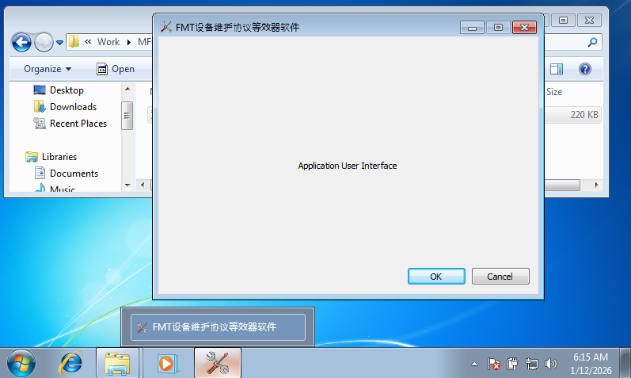

    示范程序成功运行

解决方案：安装 Microsoft Visual C++ Redistributable Package (可再发行程序包) 并补充缺失的动态链接库
###################################################################################################

总结 :numref:`对“缺少 mfc140ud.dll”问题的分析和探索` :ref:`对“缺少 mfc140ud.dll”问题的分析和探索` 得出我们的解决方案：

#. 按照 :numref:`解决方案：安装 Microsoft Visual C++ Redistributable Package (可再发行程序包)` :ref:`解决方案：安装 Microsoft Visual C++ Redistributable Package (可再发行程序包)` 安装 Visual C++ Redistributable 2022 17.0 x64 `可再发行程序包` 。
#. 通过 https://www.dll-files.com/ 这个网站获得以下缺失的动态链接库，并将其拷贝到 ``%SystemRoot%\System32`` 目录中：

    + mfc140ud.dll
    + vcruntime140d.dll
    + ucrtbased.dll
    + vcruntime140_1d.dll

验证环境：Windows 7 (验证动态库示范程序)
^^^^^^^^^^^^^^^^^^^^^^^^^^^^^^^^^^^^^^^^

按照 :numref:`运行环境` :ref:`label-section-Init-SW-Env` 准备虚拟机。如 :numref:`fig_osc_TestBox_Win7ENU` 所示，在 64 位英文版 Windows 7 虚拟机上验证示范程序是否可以正常启动和运行。

问题：无法通过安装 Microsoft Visual C++ Redistributable Package (可再发行程序包) 运行示范程序
"""""""""""""""""""""""""""""""""""""""""""""""""""""""""""""""""""""""""""""""""""""""""""""

在虚拟机上运行 Release 版示范程序，结果毫无悬念地无法启动。

按照 :numref:`解决方案：安装 Microsoft Visual C++ Redistributable Package (可再发行程序包)` :ref:`解决方案：安装 Microsoft Visual C++ Redistributable Package (可再发行程序包)` 安装 Visual C++ Redistributable 2022 17.0 x64 `可再发行程序包` 。如所 :numref:`fig_osc_Win7_InstallVCREDIST2022_FAIL` 示，安装失败。

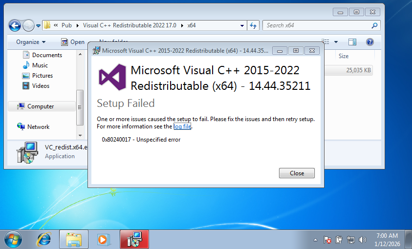

    在 Windows 7 上安装 2022 版的 vcredist 失败

尝试安装 2019、2017、2015、2013 版的 Visual C++ Redistributable Package，也失败。直到尝试安装 2012 版的 Visual C++ Redistributable Package，安装成功，如 :numref:`fig_osc_Win7_InstallVCREDIST2012_OK` 所示。

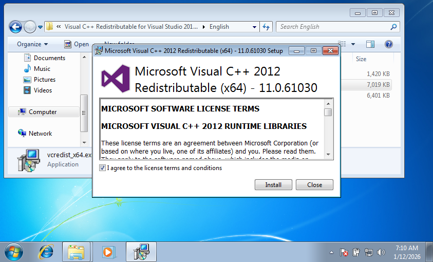

    在 Windows 7 上安装 2012 版的 vcredist

.. figure:: Resource/Images/Snipaste_2026-01-12_07-10-37.png
    :name: fig_osc_Win7_InstallVCREDIST2012_OK
    :align: center

    在 Windows 7 上安装 2012 版的 vcredist

尝试运行 Release 版的示范程序。如 :numref:`fig_osc_Win7_ExecMFCUtil_FAIL_NeedOSAPI` 所示，程序启动失败。

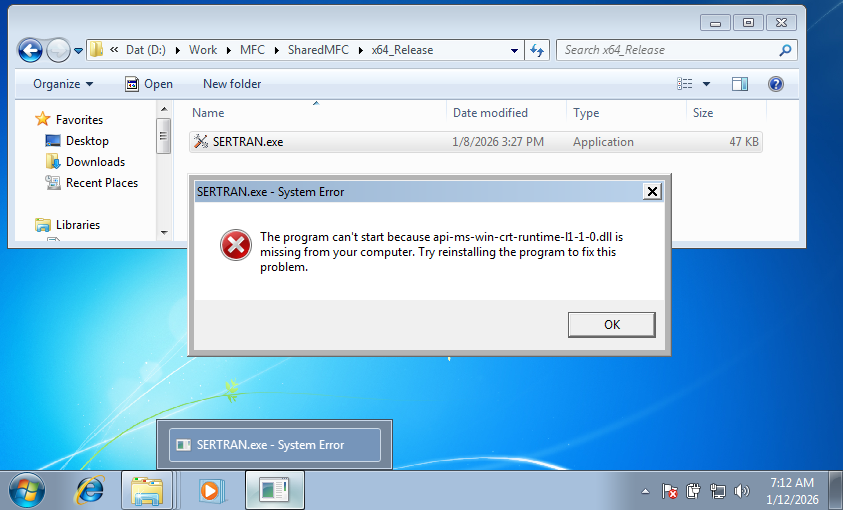

    在 Windows 7 运行 MFC 示范程序启动失败

Debug 版的示范程序也无法运行。

解决方案：安装操作系统的 Service Pack 1 升级补丁
""""""""""""""""""""""""""""""""""""""""""""""""

Windows 7 的 Service Pack 1 升级补丁可以离线安装。

.. figure:: Resource/Images/Snipaste_2026-01-12_09-37-45.png
    :name: fig_osc_Win7_Install_SP1_1
    :align: center

    安装 Service Pack 1

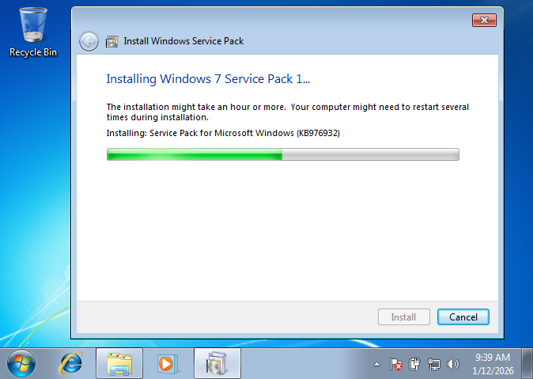

    安装 Service Pack 1

.. figure:: Resource/Images/Snipaste_2026-01-12_09-51-39.png
    :name: fig_osc_Win7_Install_SP1_3
    :align: center

    安装 Service Pack 1

.. figure:: Resource/Images/Snipaste_2026-01-12_09-53-43.png
    :name: fig_osc_Win7_Install_SP1_Done
    :align: center

    安装 Service Pack 1

如 :numref:`fig_osc_Win7_Install_SP1_Done` 所示， Service Pack 1 安装成功。之后就可以按照 :numref:`验证环境：Windows 7 Service Pack 1 (验证动态库示范程序)` :ref:`验证环境：Windows 7 Service Pack 1 (验证动态库示范程序)` 运行示范程序。

说明
----

关于Microsoft Visual C++ Redistributable Package (可再发行程序包)
~~~~~~~~~~~~~~~~~~~~~~~~~~~~~~~~~~~~~~~~~~~~~~~~~~~~~~~~~~~~~~~~~

Microsoft Visual C++ Redistributable Package (可再发行程序包) 包括 Microsoft C/C++ (MSVC) 的运行时库，安装并注册所有 Visual C++ 库。可再发行程序包的版本应与生成应用程序的 MSVC Build Tool 版本以及平台体系结构（x86/x64/ia64/arm64）相对应。

可再发行程序包的版本
^^^^^^^^^^^^^^^^^^^^

微软官方网站提供的信息表明，目前 [#f2]_ ，从 Visual Studio 2005 到 Visual Studio 2026，可再发行程序包对应版本如 :numref:`table_osc_MSVC_RedistPkgVersionsList_FromMSDN` 所示：

.. list-table:: 可再发行程序包的版本及链接（信息来源：微软官方网站）
   :name: table_osc_MSVC_RedistPkgVersionsList_FromMSDN
   :widths: 30 20
   :header-rows: 1
   :align: center

   * - Visual Studio版本
     - 可再发行程序包版本及链接
   * - Latest supported v14 (for Visual Studio 2017–2026)
     - `Visual C++ Redistributable v14 <https://learn.microsoft.com/en-us/cpp/windows/latest-supported-vc-redist>`_
   * - Visual Studio 2015
     - `Visual Studio 2015 (VC++ 14.0) <https://learn.microsoft.com/en-us/cpp/windows/latest-supported-vc-redist#visual-studio-2015-vc-140-no-longer-supported>`_
   * - Visual Studio 2013
     - `Visual Studio 2013 (VC++ 12.0) <https://learn.microsoft.com/en-us/cpp/windows/latest-supported-vc-redist#visual-studio-2013-vc-120-no-longer-supported>`_
   * - Visual Studio 2012
     - `Visual Studio 2012 (VC++ 11.0) <https://learn.microsoft.com/en-us/cpp/windows/latest-supported-vc-redist#visual-studio-2012-vc-110-update-4-no-longer-supported>`_
   * - Visual Studio 2010
     - `Visual Studio 2010 (VC++ 10.0) <https://learn.microsoft.com/en-us/cpp/windows/latest-supported-vc-redist#visual-studio-2010-vc-100-sp1-no-longer-supported>`_
   * - Visual Studio 2008
     - `Visual Studio 2008 (VC++ 9.0) <https://learn.microsoft.com/en-us/cpp/windows/latest-supported-vc-redist#visual-studio-2008-vc-90-sp1-no-longer-supported>`_
   * - Visual Studio 2005
     - `Visual Studio 2005 (VC++ 8.0) <https://learn.microsoft.com/en-us/cpp/windows/latest-supported-vc-redist#visual-studio-2005-vc-80-sp1-no-longer-supported>`_

由于微软的旧开发工具结束支持，:numref:`table_osc_MSVC_RedistPkgVersionsList_FromMSDN` 中 Visual Studio 2015 及以下版本的可再发行程序包并不都提供了有效下载链接。幸运的是，在 github 上，微软提供了这些下载链接： `Microsoft Visual C++ Redistributable latest supported downloads <https://github.com/MicrosoftDocs/cpp-docs/blob/main/docs/windows/latest-supported-vc-redist.md>`_

但是，由于 Windows 7、XP 等旧的操作系统已经结束支持，微软提供的最新的 `Visual C++ Redistributable v14` 等可再发行程序包不能在 Windows 7 （包括带 Service Pack 1 的版本）上安装，只能在 Windows 10、11 及以上版本的操作系统上安装。幸运的是，第三方网站 iTechTics.com 提供了旧版本的可再发行程序包的下载链接（文章链接： `Download All Microsoft Visual C++ Redistributables (2005-2025) <https://www.itechtics.com/microsoft-visual-c-redistributable-versions-direct-download-links/>`_ ），如 :numref:`table_osc_MSVC_RedistPkgVersionsList_FromiTechTics` 所示。

.. list-table:: 可再发行程序包的版本及链接（信息来源：iTechTics.com）
   :name: table_osc_MSVC_RedistPkgVersionsList_FromiTechTics
   :widths: 10 2 4 8 4
   :header-rows: 1
   :align: center

   * - 可再发行程序包名称
     - 版本
     - 体系结构
     - 下载链接
     - 备注
   * - Visual C++ Redistributable 2022
     - 17.0
     - x64
     - `17.0-vc_redist.x64.exe <https://aka.ms/vs/17/release/vc_redist.x64.exe>`_
     - `MSVC2022 <https://www.itechtics.com/microsoft-visual-c-redistributable-versions-direct-download-links/#microsoft-visual-c-2022-redistributable>`_
   * - Visual C++ Redistributable 2022
     - 17.0
     - 	x86
     - `17.0-vc_redist.x86.exe <https://aka.ms/vs/17/release/vc_redist.x86.exe>`_
     - \
   * - Visual C++ Redistributable 2019
     - 16.0
     - x64
     - `16.0-vc_redist.x64.exe <https://aka.ms/vs/16/release/vc_redist.x64.exe>`_
     - `MSVC2019 <https://itechtics.com/microsoft-visual-c-redistributable-versions-direct-download-links/#microsoft-visual-c-2019-redistributable>`_
   * - Visual C++ Redistributable 2019
     - 16.0
     - x86
     - `16.0-vc_redist.x86.exe <https://aka.ms/vs/16/release/vc_redist.x86.exe>`_
     - \
   * - Visual C++ Redistributable 2017
     - 15.0
     - x64
     - `15.0-vc_redist.x64.exe <https://aka.ms/vs/15/release/vc_redist.x64.exe>`_
     - `MSVC2017 <https://itechtics.com/microsoft-visual-c-redistributable-versions-direct-download-links/#microsoft-visual-c-2017-redistributable>`_
   * - Visual C++ Redistributable 2017
     - 15.0
     - x86
     - `15.0-vc_redist.x86.exe <https://aka.ms/vs/15/release/vc_redist.x86.exe>`_
     - \
   * - Visual C++ Redistributable 2015
     - 14.0
     - x64/x86
     - `VC2015_Redist <https://www.microsoft.com/en-us/download/details.aspx?id=48145>`_
     - `MSVC2015 <https://itechtics.com/microsoft-visual-c-redistributable-versions-direct-download-links/#microsoft-visual-c-2015-redistributable>`_
   * - Visual C++ Redistributable 2013
     - 12.0
     - x64
     - `12.0-vc_redist.x64.exe <https://aka.ms/highdpimfc2013x64enu>`_
     - `MSVC2013 <https://itechtics.com/microsoft-visual-c-redistributable-versions-direct-download-links/#microsoft-visual-c-2013-redistributable>`_
   * - Visual C++ Redistributable 2013
     - 12.0
     - x86
     - `12.0-vc_redist.x86.exe <https://aka.ms/highdpimfc2013x86enu>`_
     - \
   * - Visual C++ Redistributable 2012
     - 11.0
     - x64
     - `11.0-vc_redist.x64.exe <https://download.microsoft.com/download/1/6/B/16B06F60-3B20-4FF2-B699-5E9B7962F9AE/VSU_4/vcredist_x64.exe>`_
     - `MSVC2012 <https://itechtics.com/microsoft-visual-c-redistributable-versions-direct-download-links/#microsoft-visual-c-2013-redistributable>`_
   * - Visual C++ Redistributable 2012
     - 11.0
     - x86
     - `11.0-vc_redist.x86.exe <https://download.microsoft.com/download/1/6/B/16B06F60-3B20-4FF2-B699-5E9B7962F9AE/VSU_4/vcredist_x86.exe>`_
     - \
   * - Visual C++ Redistributable 2010
     - 10.0
     - x64
     - `10.0-vc_redist.x64.exe <https://download.microsoft.com/download/1/6/5/165255E7-1014-4D0A-B094-B6A430A6BFFC/vcredist_x64.exe>`_
     - `MSVC2010 <https://itechtics.com/microsoft-visual-c-redistributable-versions-direct-download-links/#microsoft-visual-c-2010-redistributable>`_
   * - Visual C++ Redistributable 2010
     - 10.0
     - x86
     - `10.0-vc_redist.x86.exe <https://download.microsoft.com/download/1/6/5/165255E7-1014-4D0A-B094-B6A430A6BFFC/vcredist_x86.exe>`_
     - \
   * - Visual C++ Redistributable 2008
     - 9.0
     - x64
     - `9.0-vc_redist.x64.exe <https://download.microsoft.com/download/5/D/8/5D8C65CB-C849-4025-8E95-C3966CAFD8AE/vcredist_x86.exe>`_
     - `MSVC2008 <https://itechtics.com/microsoft-visual-c-redistributable-versions-direct-download-links/#microsoft-visual-c-2008-redistributable>`_
   * - Visual C++ Redistributable 2008
     - 9.0
     - x86
     - `9.0-vc_redist.x86.exe <https://download.microsoft.com/download/5/D/8/5D8C65CB-C849-4025-8E95-C3966CAFD8AE/vcredist_x86.exe>`_
     - \
   * - Visual C++ Redistributable 2005
     - 8.0
     - x64/x86
     - `VC2005_Redist <https://www.microsoft.com/en-us/download/details.aspx?id=26347>`_
     - `MSVC2005 <https://itechtics.com/microsoft-visual-c-redistributable-versions-direct-download-links/#microsoft-visual-c-2005-redistributable>`_

为了防止以上下载链接失效，我在百度网盘上提供了分享链接： `Visual_C++_Redistributable_Packages <https://pan.baidu.com/s/1biR2OAZkCgI9HWeSvHqWYQ?pwd=msdn>`_

可再发行程序包的版本选择
^^^^^^^^^^^^^^^^^^^^^^^^

开发环境中采用 Visual Studio 2017-2026
""""""""""""""""""""""""""""""""""""""

如果在开发环境中采用 Visual Studio 2017-2026，运行环境的操作系统版本，与运行环境中应安装的 Visual C++ 可再发行程序包版本之间的对应关系如 :numref:`table_osc_MSVC_RedistPkgVersionsList_SelectPolicy` 所示。

.. list-table:: 运行环境中应安装的 MSVC 可再发行程序包的版本选择
   :name: table_osc_MSVC_RedistPkgVersionsList_SelectPolicy
   :widths: 14 14 15
   :header-rows: 1
   :align: center

   * - 开发环境 Visual Studio 版本
     - 操作系统版本
     - 可再发行程序包版本
   * - Visual Studio 2017–2026
     - Windows 10 及更高版本
     - Latest supported v14
   * - Visual Studio 2017–2026
     - Windows 7 Service Pack 1

       (Build 7601)
     - Visual C++ Redistributable 2022 17.0

如果运行环境的操作系统版本为 Windows 7 (Build 7600)，建议在运行环境中安装操作系统的 Service Pack 1 补丁，将其升级为 Windows 7 Service Pack 1 (Build 7601)，然后安装 Visual C++ Redistributable 2022 17.0 可再发行程序包。

开发环境中采用 Visual Studio 2005 及更低的版本
""""""""""""""""""""""""""""""""""""""""""""""

按照 :numref:`table_osc_MSVC_RedistPkgVersionsList_FromiTechTics` 安装相应的 Visual C++ 可再发行程序包。

.. _label-section-conclusion:

结论和建议
----------

采用 MFC 开发的应用程序能够以非常小的代价广泛兼容各种版本的 Windows 操作系统，但是，如果应用不当，也会导致程序无法顺利地在目标平台（运行环境）上运行。因此，本文总结出以下建议供用户和开发者参考。

给最终用户的建议
~~~~~~~~~~~~~~~~~

尽管 MFC 程序可以运行在 Windows 11 操作系统上，但是截止到目前 [#f2]_ 为止，在工业领域，通常不建议将运行环境升级到 Windows 11。

如果需要将程序运行在 Windows 7 操作系统上，应尽可能安装 Service Pack 1 补丁（如已安装请略过此建议）。

给开发者的建议
~~~~~~~~~~~~~~~~~

如果希望程序运行在 Windows 7 及更高版本的 Windows 操作系统上，建议尽量使用高版本的 Visual Studio，尤其是 Visual Studio 2017 及更高版本，因为从 Visual Studio 2017 到 Visual Studio 2026，可再发行程序包统一到了 v14 版，而在 2017 之前的 Visual Studio 各个版本的可再发行程序包不是统一的。

我本人从 Visual C++ 5.0 一直到 Visual Studio 2026 各个版本都用过，Visual Studio 2022、2026 相比之前的版本有巨大的进步，而且我不认为用户需要我兼容 Windows 7 之前的操作系统，所以我非常建议采用 Visual Studio 2022 / 2026 开发 MFC 程序。

如果希望程序运行在 Windows XP 操作系统上，建议采用 Visual Studio 2015 并启用 `Windows XP 支持` 这一特性。如果希望程序运行在比 Windows XP 更早的操作系统上，请采用该操作系统同一时代的 Visual Studio。

在构建 MFC 应用程序时，选择在静态库中使用 MFC 类库，或者在共享动态链接库中使用 MFC 类库，各有优劣（详见 :numref:`比较示例程序的构建方案` :ref:`比较示例程序的构建方案` ）。如果希望程序拷贝到运行环境中就能直接运行，比较省事的做法是在静态库中使用 MFC 类库。

注意给最终用户发布 Release 版的应用程序。有些人可能会不小心把 Debug 版的程序交给用户，应该避免这样做。

如果希望目标平台（运行环境）提前安装 Microsoft Visual C++ Redistributable Package (可再发行程序包)，请注意，Windows 10 及更高版本的操作系统可以直接从微软官方网站获取最新的 v14 可再发行程序包进行安装，但是 Windows 7 Service Pack 1 操作系统需要安装 Visual C++ Redistributable 2022 17.0，这个版本的再发行程序包目前无法直接从微软官方网站下载，请参考 :numref:`可再发行程序包的版本` :ref:`可再发行程序包的版本` 获得这一特定版本。

脚注：

.. [#f1] MSDN：`配置适用于 Windows XP 的程序 <https://learn.microsoft.com/zh-cn/cpp/build/configuring-programs-for-windows-xp?view=msvc-170>`_
.. [#f2] 文中提到的“目前、当前”，都是指截止到撰写本文时（2026年1月）的情形。

参考链接：

#. `Setting WINVER for MFC Applications <https://devblogs.microsoft.com/cppblog/setting-winver-for-mfc-applications/>`_
#. `MSDN: 重新分发 Visual C++ 文件 <https://learn.microsoft.com/zh-cn/cpp/windows/redistributing-visual-cpp-files>`_
#. `MSDN: Microsoft Visual C++ 可再发行程序包最新支持的下载 <https://learn.microsoft.com/zh-cn/cpp/windows/latest-supported-vc-redist>`_
#. `MSDN: Visual Studio 版本之间的 C++ 二进制兼容性 <https://learn.microsoft.com/zh-cn/cpp/porting/binary-compat-2015-2017?view=msvc-170>`_
#. `iTechTics: Download All Microsoft Visual C++ Redistributables (2005-2025) <https://www.itechtics.com/microsoft-visual-c-redistributable-versions-direct-download-links/>`_
#. `Microsoft C++, C, and Assembler documentation <https://github.com/MicrosoftDocs/cpp-docs>`_
#. `Downloading and Installing Windows 7 Service Pack One <https://www.elmajdal.net/win7/downloading-and-installing-windows-7-service-pack-one/>`_
#. `Microsoft® Update Catalog: KB976932 <https://www.catalog.update.microsoft.com/Search.aspx?q=KB976932>`_
#. `Windows Installer 可再发行组件 <https://learn.microsoft.com/zh-cn/windows/win32/msi/windows-installer-redistributables>`_
#. `演练：使用 Visual C++ Redistributable 包部署 Visual C++ 应用程序 <https://learn.microsoft.com/zh-cn/cpp/windows/deploying-visual-cpp-application-by-using-the-vcpp-redistributable-package?view=msvc-170>`_
#. `确定要重新分发的 DLL <https://learn.microsoft.com/zh-cn/cpp/windows/determining-which-dlls-to-redistribute?view=msvc-170>`_
#. `部署本机桌面应用程序（Microsoft C++） <https://learn.microsoft.com/zh-cn/cpp/windows/deploying-native-desktop-applications-visual-cpp?view=msvc-170>`_
#. `安装 Microsoft Visual C++ 可再发行程序包 <https://handbook.aaether.net/pages/install-vcredist.html>`_
#. `Redistributing the MFC Library <https://learn.microsoft.com/en-us/cpp/windows/redistributing-the-mfc-library?view=msvc-170>`_
#. `Redistributing Visual C++ Files <https://learn.microsoft.com/en-us/cpp/windows/redistributing-visual-cpp-files?view=msvc-170>`_
